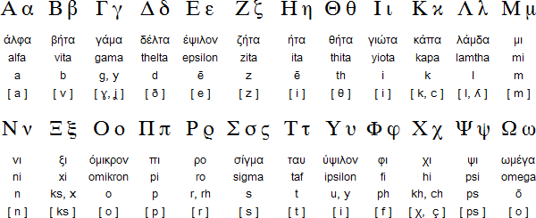

# Αλφάβητο

# Two-letter combinations
## Vowels
* __αι [e]__ Pronounced the same as ε.
* __ει [i]__ Pronounced the same as ι, η and υ.
* __οι [i]__ Pronounced the same as ι, η and υ.
* __υι [i]__ Pronounced the same as ι, η and υ.
* __ου [u]__  Pronounced like _loot_ or _school_

## Consonants
 * __μπ [b] / [mb]__ Pronounced like _**b**all_ or _e**mb**assy_ depending on the place it is in the word; If μπ is situated at the beginning of a word it is pronounced [b], otherwise [mb].
 * __ντ [d] / [nd]__ Pronounced like _**d**own_ or _A**nd**es_.
 * __γκ [g] / [ng]__ Pronounced like _**g**oal_ or _a**ng**ry_ following the same rule as μπ; [g] at the beginning of the word, [ng] otherwise.
 * __γγ [g] / [ng]__ Pronounced the same as _γκ_, but since there are no Greek words beginning with γγ, just [ng] pronunciation is used.
 * __τσ [ts]__ Pronounced like _**ch**ain_ or _tou**ch**_, but with less sharp accent.
 * __τζ [dz]__ Pronounced like _**j**oke__ or _en**g**ine__, but with less sharp accent, as mentioned before for τσ.

## αυ, ευ
These combinations are pronounced __[av]__ and __[ev]__ respectively, when followed by a vowel or a voiced consonant (e.g. _ευανάγνωστος_, _αύριο_) and [af] and [ef] respectively, when followed by an unvoiced consonant (e.g. _αυτοκίνητο_, _κατεύθυνση_)
